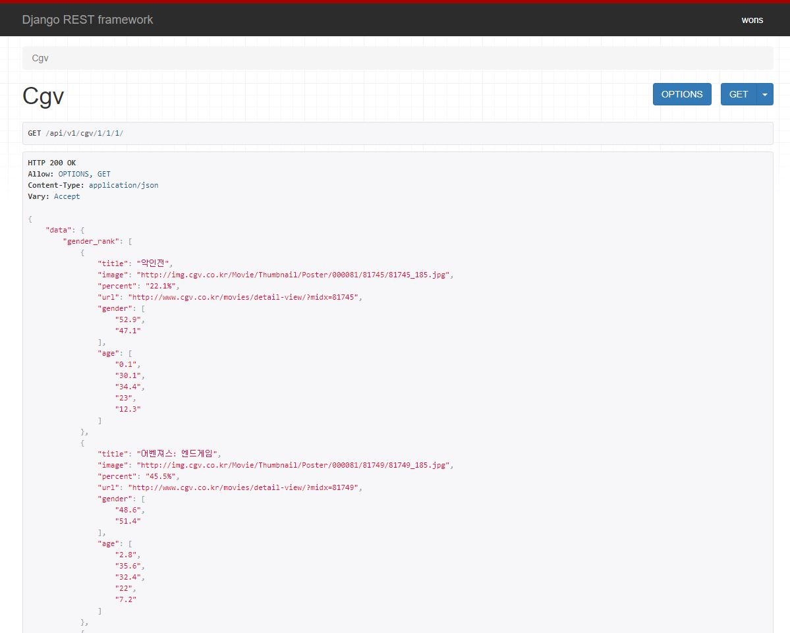
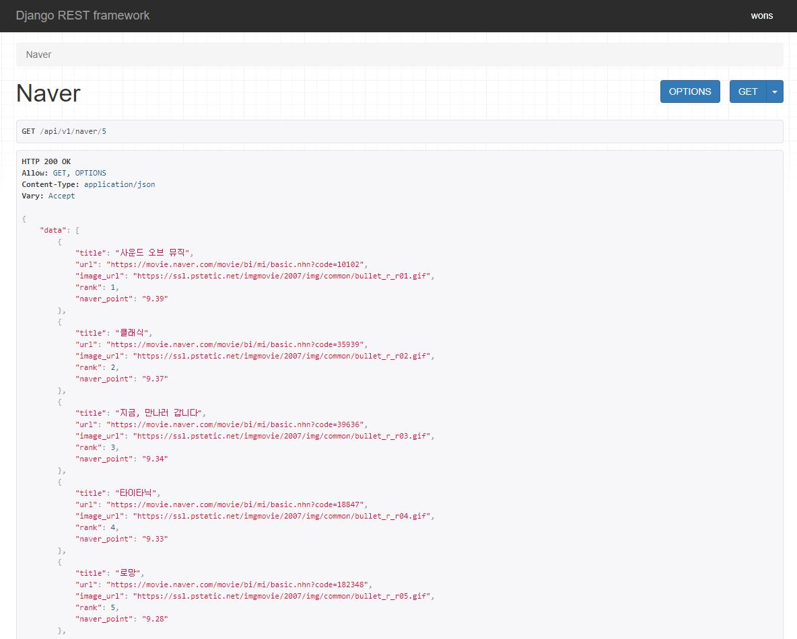

# 영화추천 프로젝트 - WONS

## 1. 프로젝트 목표

- 영화 추천 서비스 구현
- HTML/CSS/JS 등을 활용한 실제 서비스 설계
- Git을 통한 소스코드 버전 관리 및 협업

## 2. 팀원 정보 및 업무 분담 내역

- 이주원
  - 26살인디, 송파구 거주
  - accounts, movies view 작성
  - template 만들기, css 극복, 이쁘게 꾸미기
- 박해원
  - 26살인디, 서대문구 거주
  - Data 크롤링, 데이터베이스 구축
  - 추천시스템 구축 : API 서버 + Vue 구현
  - template 만들기, css 극복, 이쁘게 꾸미기

## 3. 목표 서비스 구현

1. 목표

   > 우리의 목표는 크게 영화 평점 시스템과 추천 시스템 구현으로 나눌 수 있다. 영화 데이터 베이스를 구축해놓고, 해당 영화 데이터베이스에 자신이 본 영화의 평점과 댓글을 남길 수 있다. 추천 시스템은 현재 박스오피스 인기 순위, 연령별, 성별 영화 선호 비율을 사용하여 구현할 것을 생각하였다.

2. 실제 구현 정도:

   > 실제 구현 정도는 80%라고 할 수 있다. 유저 간 소통할 수 있는 follow 기능을 구현하지 못했다. 그러나 추천 시스템, 영화 평점 시스템은 목표했던 것 만큼 구현하였다.

## 4. 개발환경

1) (필수) Python Web Framework
	A. Django 2.1.x
	B. Python 3.6.x

2) 서비스 배포 환경
	A. 서버 : Ubuntu
	B. Database : SQLite

## 5. 서비스 설명

### file tree

├── accounts
│   ├── __init__.py
│   ├── __pycache__
│   ├── admin.py
│   ├── apps.py
│   ├── forms.py
│   ├── migrations
│   ├── models.py
│   ├── templates
│   │   └── accounts
│   │       ├── login.html
│   │       ├── mypage.html
│   │       ├── signup.html
│   │       └── update.html
│   ├── tests.py
│   ├── urls.py
│   └── views.py
├── api
│   ├── __init__.py
│   ├── __pycache__
│   ├── admin.py
│   ├── apps.py
│   ├── migrations
│   ├── models.py
│   ├── tests.py
│   ├── urls.py
│   └── views.py
├── db.sqlite3
├── manage.py
├── movie
│   ├── __init__.py
│   ├── __pycache__
│   ├── settings.py
│   ├── urls.py
│   └── wsgi.py
├── movies
│   ├── __init__.py
│   ├── __pycache__
│   ├── admin.py
│   ├── apps.py
│   ├── fixtures
│   │   ├── boxoffice.json
│   │   ├── genre.json
│   │   ├── image.json
│   │   ├── movie.json
│   │   └── movie_naver.json
│   ├── forms.py
│   ├── migrations
│   ├── models.py
│   ├── templates
│   │   └── movies
│   │       ├── create.html
│   │       ├── current.html
│   │       ├── detail.html
│   │       ├── list.html
│   │       ├── recommend.html
│   │       ├── start.html
│   │       └── update.html
│   ├── tests.py
│   ├── urls.py
│   └── views.py
├── staticfiles
└── templates
    ├── 404.html
    ├── base.html
    └── nav.html

### 데이터베이스 모델링

### accounts

1. User model

   > django에서 제공하는 AuthUserModel을 사용하였다.

2. 관리자 권한(superuser) 유저만 영화 등록 및 수정, 삭제 권한을 가진다.

   > user모델에 따로 is_staff를 추가하지 않아도 django의 is_superuser 함수를 사용하여 사용자가 superuser인지 확인하였다.

3. 유저 로그인, 로그아웃

   > django에서 제공하는 login, logout 함수(Authentication Form)를 사용하여 로그인, 로그아웃을 구현하였다.

4. 유저 가입, 업데이트

   > django에서 제공하는 UserCreationForm, UserChangeForm을 이용하여 회원가입, 정보 수정등을 구현하였다. 

5. 마이페이지

   > 마이페이지에서는 자신이 작성한 평점, 한줄평을 볼 수 있다.

### movies

1. Movie model

   > API에서 받아온 영화 정보들을 저장하는 곳이다.
   >
   > 제목, 장르, 감독, 국가, 개봉일, 관람등급, 네이버 예매 링크, 포스터이미지, 줄거리, 누적 관객수, 유저 평점 등이 담겨있다.

2. 영화 생성, 수정, 삭제

   > 관리자 유저인지 확인한다. `is_superuser`
   >
   > 해당 유저이면 기능에 맞게 영화를 생성, 수정 또는 삭제한다.

3. 영화 리스트

   > API에서 받아온 50개의 영화를 화면에 출력한다.
   >
   > 각 영화 이미지에 마우스를 올리면 네이버에서 받아온 해당 영화의 평점, 프로젝트에서 생성한 Ratings 모델에 저장된 평점을 보여준다.
   >
   > 해당 이미지를 클릭하면 영화 상세정보 페이지로 넘어간다.

4. 영화 상세정보

   > 해당 영화에 대한 상세 정보를 보여준다.
   >
   > 제목, 감독, 상영시간, 장르, 상세정보, 영화 이미지 등을 확인할 수 있다.
   >
   > 해당 유저(로그인된 유저)가 평점을 남기지 않았다면 평점을 작성할 수 있는 form이 띄워지고 평점을 남겼다면 더 이상 평점을 남길 수 없다.
   >
   > 이전에 다른 유저들이 작성했던 평점을 확인할 수 있다.
   >
   > 자신이 남긴 평점에 대해서는 수정, 삭제 버튼이 보이고 버튼을 누르면 수정/ 삭제가 가능하다.

5. 영화 정보 수정, 삭제

   > `POST` 방식으로 접근해야 수정, 삭제가 가능하다.
   >
   > `FORM`을 활용하여 수정하기에 용이하다. 

6. 영화 평점 

   > 로그인을 해야 평점을 작성할 수 있다.
   >
   > `form`을 이용하여 작성한 후 유효한 값이면 폼을 작성한 사람을 현재 유저로 정의한 후 저장한다. -> db에 반영

7. 영화 평점 수정, 삭제

   > 영화 정보 수정, 삭제와 마찬가지로 로그인된 유저가 본인이어야하며 `POST` 방식으로 접근해야 한다.

### API

1.  다음 예매 순위
2. cgv 성별, 연령대별 순위
3. 네이버 장르별 순위

이렇게 3가지의 정보를 사용자로부터 입력 받아서 (원하는 장르, 성별, 연령대), 실시간으로 크롤링을 해와서 띄워주었다.

## 5. 배포서버 URL

1. https://final-movie-hzzle.c9users.io/
2. https://final-project-zoo1.c9users.io

## 6. 기타 (느낀점)

- 이주원

  > 짝꿍이 많은 도움을 주어서 할 수 있었던 프로젝트였다. 앞으로 웹 크롤링과 vue를 더 공부해야겠다. 

- 박해원

  > 기획부터 구현까지 짝꿍과 함께 너무 재밌게 했던 것 같다. 시간에 쫓겨서 추가 기능들을 구현해 보지 못했지만, 시간이 된다면 기능 추가 욕심이 생겼다. 그리고 css는 정말 나의 성향과 안 맞다고 느꼈다. 나머지 구현은 생각보다 재밌었다. 좋은 경험이었다.
